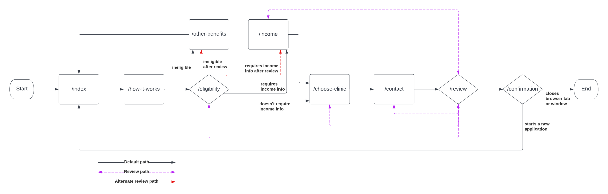

# Application Architecture

## Routing

The eligibility screener is a multi-page form wizard. On most pages, there is a back link that lets the user go back a step in the wizard (handled by `getBackRoute()`) and a call to action button that moves the user forward a step in the wizard (handled by `getForwardRoute()`). In addition, once the user makes it to the /review page, they are allowed to edit any data they entered on a previous page and then return to the /review page once they are done making edits.

Generally speaking, the path through the form wizard is pretty linear, with exceptions on the /eligibility page:

- From /eligibility, the user may be routed to /other-benefits if they select options that indicate they are likely not eligible for WIC
- From /eligibility, if the user indicates that they are enrolled in a qualifying adjunctive program, such as medicaid or SNAP, they will be routed directly to /choose-clinic
- From /eligibility, if the user indicates that they are NOT enrolled in a qualifying adjunctive program, they will be routed to /income

Routing logic is handled in `/app/src/utils/routing.ts`.

## Gating Page Access

We need to prevent the user from directly navigating to a page further in the wizard flow than they should be allowed (handled by getRoutingIssues()). For example, if you haven't filled out /eligibility, you can't jump directly to /review because you will be missing data for required form fields.

Each successive page in the form wizard requires all the pages before it in the flow to be filled out. Otherwise, the user gets redirected to the earliest page that they have not filled out. For example, if a user tries to navigate directly to /review having filled out /eligibility, but not /income, they will be routed back to /income.

If a user tries to access a page in the form wizard flow (say /review), but they haven't filled out valid data for all previous pages, then they will be routed to the "redirect" page (the first page in the flow that is missing data) and shown an error alert instructing them to fill out missing fields.

This handles two cases:

- Link sharing: if a user is accidentally shared a link directly to a page in the middle of the form wizard flow, they will get directed back to the beginning.
- Data corruption: if the data in the react state or session storage is corrupted somehow, the user flow can be rescued by sending them back to fill in the missing data

Gating page access logic is handled in `/app/src/utils/routing.ts`.

## Data Management

User data is stored first on a per-page basis in a state on each page called `form`, which controls what the form on the page is showing to the user. This state is initialized with blank data from `app/src/utils/sessionData.ts` rather than the session prop in order to avoid really weird react state bugs. Using a `useEffect()`, any time `form` is updated, we also update the global state called `session` which is owned by `/app/src/pages/_app.tsx` and passed in as a prop. The `useEffect()` also loads the user data after the component is mounted and avoids SSR hydration issues.

`session` is both a global state and is stored in the browser's session storage to enable the user to refresh the page without losing state. Most form pages have a state called `disabled` that manages whether the call to action button at the bottom of the page is enabled/disabled. It should only be enabled when all required fields have been filled out.

Most form pages also have a `handleChange()` function that is passed to each form element. Whenever the user changes a form element, the local form state and the global session state are updated.

## Data Persistence

All the user-inputted data submitted in the form wizard page is stored in session storage for the duration of a user "session". Because this is stored in session storage, rather than local storage, it persists through page refreshes, but is deleted when the browser/tab is closed, supporting a project goal to protect user data as much as possible.

This data is explicitly cleared in 2 circumstances:

- On /other-benefits, when the user clicks the "return to start page" button
- On /confirmation, when the user clicks the "start a new application" button
